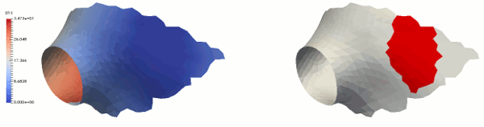
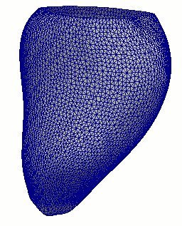
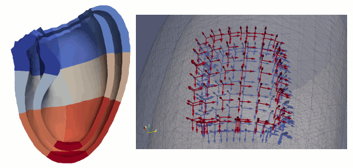

# Introduction and licensing
This is a collection of different tools I had to develop.
Everything in this repository is licensed under the Attribution-NonCommercial-ShareAlike 4.0 International License.

The collection is in a bit of a disarray and documentation need to be improved. 

#To do
-[] Add tests
-[] Split CommonTools into vtk only and itk/vtk parts

#Contents of subfolders
##BasicMeshoperations
A collection of random tools to use with meshes: mesh converters, mesh smoothers, distance transforms, etc.

##DistTransform
Calculates a distance transform on a mesh from a collection of seeds (uses fast marching)
The distance is calculated from blobs stored in vtkShortArray associated with the vertices. The distance of the point *point_id* to the blob *blob_id* is returned in array "DT" and can be accessed by
```
array = polydata.GetPointData().GetArray('DT')
tuple = array.GetTuple(point_id)
distance = tuple[blob_id]
```
Example image:



##FillSurfaceHoles
Detects and fills holes on the surface. Currently under construction. Current version implements P. Liepa "Filling Holes in Meshes" without smoothing. To be added soon. Here's a sample result

- Add smoothing


##LVMeshFromMRI
Creates a smoother mesh using splines longitudinally from short axis contours in MRI and a reference point.
This was ported from VTK 5.x and needs testing. There's also a python script in [Python/mri_mesh_from_contours](Python/mri_mesh_from_contours). 
The input shape are the landmarks in 3D. One of them is the reference point (which is either the first or the last or has a special ID). 
Also it is possible that the IDs are used to differentiate between endocardiumn and epicardium. Check the code.
Example reconstrautcion:

- The code needs a better documentation
- Python script was failing with the new VTK/mayavi
- Compilation fails with vmtk from Ubuntu 16.04 distribution. Need a replacement. For now uniform remeshing is disabled.


##VolumetricLVMesh 
Generates a volumetric mesh of cardiac Left Ventricle (half-ellipsoid like). 
The elements are wedges aligned radially. Might have some additional requirements.
To be verified. This was ported from VTK 5.x and needs testing. An example mesh with associate local coordinates can be seen in the following figure

- Test

##layer_Generation_code
Generates a volumetric mesh of any structure with two boundaries. 
The elements are wedges aligned radially. 
This was ported from VTK 5.x and needs testing. 
- Test

##Python
Some programs written in python. In particular mesh flattening.


##IrisTools
A couple of internal use tools. 


